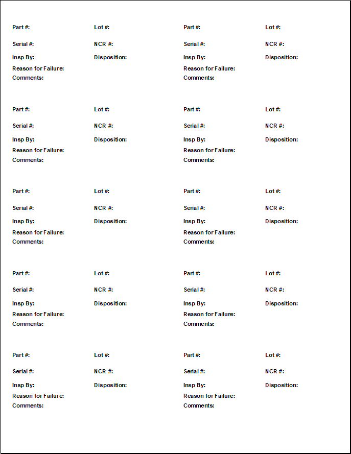

# NCR Label Generator


A dual-purpose Excel tool designed to generate standardized NCR (Non-Conformance Report) labels. It functions as both a batch printer for existing data and a generator for blank, hand-writable forms for the shop floor.

## 🏷️ Label Specifications
This tool is calibrated for **metric adhesive label sheets** with the following dimensions:

* **Label Size:** 100mm x 50mm
* **Layout:** 2 Columns x 5 Rows (10 labels per sheet)
* **Sheet Margins:**
    * Top: ~11.6 mm
    * Bottom: ~13 mm
    * Side: ~4 mm
* **Gap:** 4mm horizontal gap between columns (0mm vertical gap)

## 🚀 Features

* **Pixel-Perfect Layout:** Uses a Python script to build an Excel grid that aligns perfectly with physical label media, bypassing standard Excel "character width" inaccuracies.
* **Smart Formatting:**
    * Automatic indentation and top-padding for readability.
    * Dynamic horizontal spacing to align "Lot #" and "NCR #" fields.
    * Borderless printing for a clean, professional look.
* **Dual Modes:**
    1.  **Data Mode:** Reads rows from the "Input" sheet and generates a specific label for every entry.
    2.  **Blank Mode:** If the "Input" sheet is empty, it automatically generates 10 clean, blank labels with lines for handwriting.

## 🛠️ Installation & Setup

1.  **Build the Template**
    This project uses Python to generate the precise Excel geometry (row heights/column widths) required for printing.

    ```bash
    # Run the build script to create the Excel file
    python build_template.py
    ```

2.  **Enable Macros**
    * Open the generated file: `NCR_Label_Generator.xlsx`.
    * Save the file as an **Excel Macro-Enabled Workbook (.xlsm)**.
    * Press `ALT + F11` to open the VBA Editor.
    * Insert a new Module and paste the code from `label_logic.vba`.
    * Close the VBA Editor.

3.  **Add the Button**
    * Go to the **Developer** tab in Excel.
    * Click **Insert** > **Button (Form Control)**.
    * Draw the button on the "Input" sheet (around cell I2).
    * Assign the `GenerateLabels` macro to the button.
    * Rename the button to "Generate Labels".

## 📖 Usage Guide

### To Print Specific Labels
1.  Open the **Input** sheet.
2.  Fill in the columns (Part #, Lot #, Serial #, NCR #, etc.).
3.  Click **Generate Labels**.
4.  Go to the **Labels** sheet and Print (Ensure scaling is set to 100%).

### To Print Blank Forms
1.  Open the **Input** sheet.
2.  **Clear all data** from row 2 downwards (keep the headers!).
3.  Click **Generate Labels**.
4.  The tool will detect the empty data and generate one full sheet (10 labels) of blank forms.

## 👤 Author
**Jason Sparks** - [GitHub Profile](https://github.com/webdev-jason)

## 📄 License
This project is licensed under the MIT License - see the [LICENSE](LICENSE) file for details.